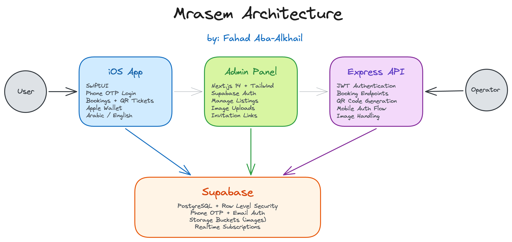

# Mrasem مراسم

<p align="center">
  
</p>

A concierge-style iOS app for booking premium experiences across Saudi Arabia — restaurants, activities, seasonal events, car services, and private invitations. Built for a client as a full-stack project covering the mobile app, admin dashboard, and backend.

> **Note:** This repo is for portfolio/demonstration purposes only. Not all source code, assets, or configurations are included — this was a paid client project and certain parts are intentionally excluded to protect the client's business and IP.

## What it does

Mrasem is a luxury lifestyle app targeting Saudi users. Think of it like a curated booking platform where you can:

- Browse and book restaurants, desert activities, cultural tours across Riyadh, Mecca, AlUla, and the Southern region
- Book private car services (S-Class, Yukon, Lucid Air, etc.)
- View and RSVP to seasonal events
- Create and send digital invitations with custom designs
- Manage a membership with QR-based check-in
- Switch between Arabic and English seamlessly

The admin panel lets the operator manage all listings, upload images, handle bookings, and generate invite links.

## Architecture

<p align="center">
  
</p>

## Tech Stack

| Layer | Tech |
|-------|------|
| Mobile | SwiftUI, Combine, Keychain, Apple Wallet PassKit |
| Admin | Next.js 14, Tailwind CSS, Supabase SSR |
| API | Express.js, JWT, better-sqlite3, multer |
| Database | Supabase (PostgreSQL + RLS policies) |
| Auth | Supabase Phone OTP (mobile), Supabase email/pass (admin) |
| Storage | Supabase Storage buckets |
| Deployment | Vercel (admin), Supabase cloud (DB) |

## Project Structure

```
Mrasem/
├── Mrasem/                    # iOS app (Xcode project)
│   ├── Screens/               # SwiftUI views
│   ├── Models/                # Codable data models
│   ├── Services/              # API client, Supabase auth, Keychain
│   ├── Stores/                # ObservableObject state management
│   ├── Managers/              # Auth manager, secure storage
│   └── Assets.xcassets/       # Images and icons
├── mrasem-admin-next/         # Admin dashboard (Next.js)
│   ├── app/                   # App router pages
│   ├── components/            # Reusable UI components
│   └── lib/                   # Supabase client, types, utilities
├── admin-panel/               # Express API + React admin
│   ├── server/                # Express routes, middleware
│   └── client/                # React + Vite frontend
├── supabase/
│   └── migrations/            # SQL migrations
└── docs/                      # Architecture diagrams
```

## Key Features

### iOS App
- Phone number login with OTP verification (Supabase Auth)
- Onboarding flow with category selection
- Restaurant/activity/event listing with filters and search
- Full booking flow → confirmation → QR ticket → Apple Wallet pass
- Digital invitation composer with custom templates
- Side panel navigation with membership card
- Full Arabic/English localization (RTL support)
- Secure token storage via Keychain

### Admin Panel
- Protected dashboard with Supabase auth
- CRUD for restaurants, activities, seasonal events
- Image upload with Supabase Storage
- Invitation link generator with web preview
- Arabic/English content management for all listings

### Backend
- JWT-based auth for mobile users
- Booking creation and management endpoints
- QR code generation for tickets
- Database migrations with RLS policies

## Running Locally

### iOS App
Open `Mrasem/Mrasem.xcodeproj` in Xcode and run on simulator or device. Requires iOS 17+.

### Admin Panel
```bash
cd mrasem-admin-next
cp .env.example .env.local   # fill in your Supabase keys
npm install
npm run dev
```

### Express API
```bash
cd admin-panel
npm install
npm start
```

## About

Built by **Fahad Aba-Alkhail** as a freelance project. The app targets the Saudi luxury/concierge market with a focus on clean UI, bilingual support, and a smooth booking experience.

---

*Some files, environment configs, assets, and internal documentation are excluded from this repository. This code is shared for portfolio purposes and cannot be used to reproduce the full application.*
